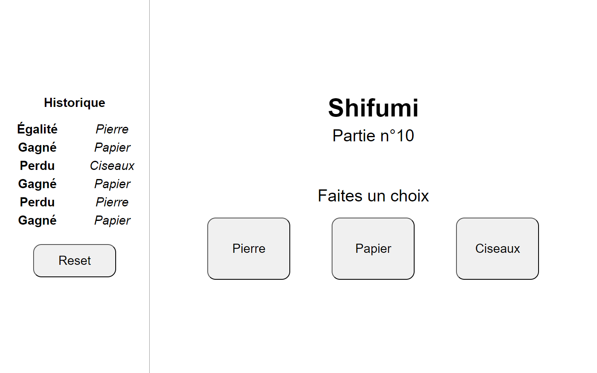

# Shifumi

 

A Rock-Paper-Scissors game implemented in PHP, utilizing a SQL database to store all played games.

Features include:

- Displaying the results of the last 6 games.
- A reset option for clearing the game history.
- Dynamically showing the current round number based on the total rounds played so far.

 

	

 
